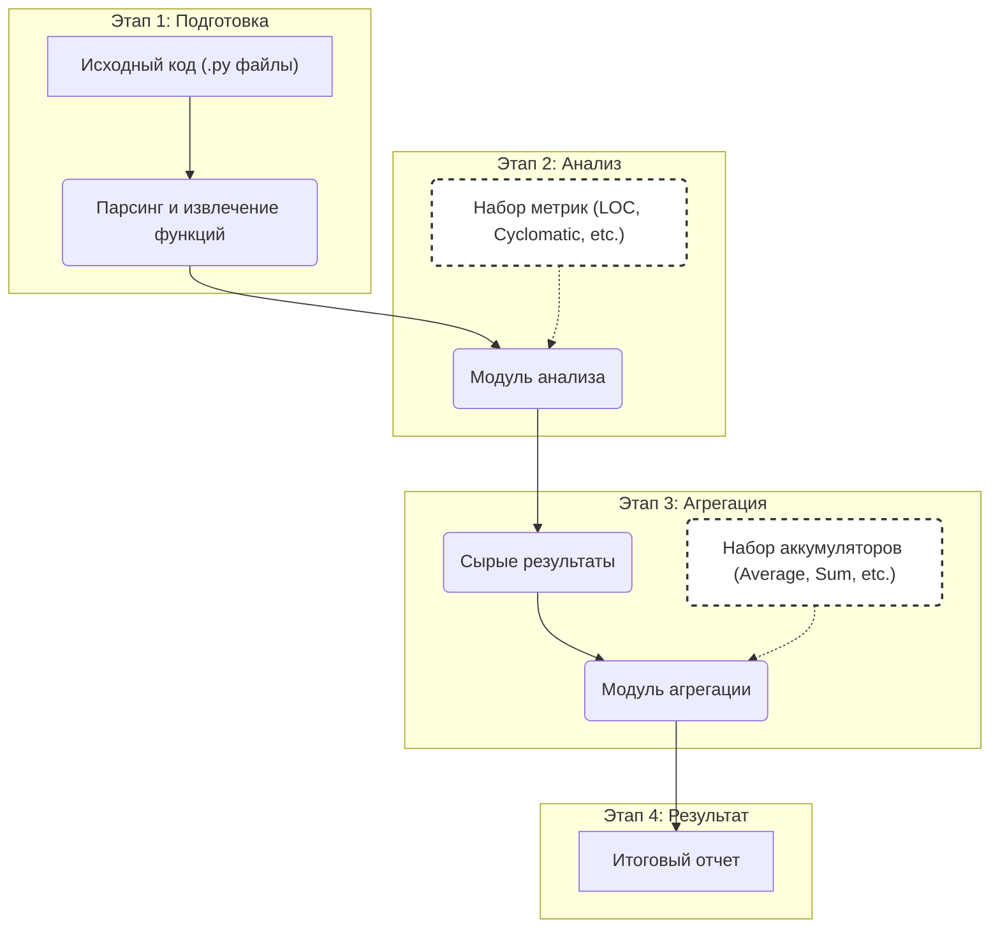

# Анализатор Python-кода на C++

Проект представляет собой статический анализатор кода для языка Python, разработанный на C++. Приложение анализирует исходные файлы, вычисляет метрики для функций и методов, а также агрегирует полученные результаты.

Ключевой особенностью проекта является широкое использование современных возможностей C++ (в частности, C++20/23), особенно библиотеки диапазонов (`std::ranges`) для построения декларативных и функциональных конвейеров обработки данных.

## Основные возможности

- **Вычисление метрик кода:**
  - **Количество строк кода (LOC):** Подсчёт непустых строк, не являющихся комментариями.
  - **Цикломатическая сложность:** Измерение сложности кода на основе управляющих конструкций (`if`, `for`, `while`, `try`, `assert` и др.).
  - **Количество параметров функции.**
  - **Стиль именования (Naming Style):** Определение `snake_case`, `camelCase`, `PascalCase` и других стилей.

- **Агрегация метрик:**
  - **Сумма и среднее значение** для метрик, таких как LOC и цикломатическая сложность.
  - **Среднее значение** для количества параметров.
  - **Подсчёт по категориям** для стилей именования.

- **Группировка результатов:**
  - Анализ и вывод результатов в разрезе отдельных файлов.
  - Анализ и вывод результатов в разрезе отдельных классов.
  - Общий анализ по всем найденным функциям.

## Технологический стек

- **Язык:** C++20/23
- **Система сборки:** CMake
- **Менеджер зависимостей:** Conan
- **Парсинг AST:** tree-sitter
- **Обработка аргументов командной строки:** Boost.Program_options
- **Тестирование:** GoogleTest
- **Обработка данных:** `std::ranges`

## Схема работы



## Сборка и запуск

### 1. Подготовка окружения

Проект использует `conan` для управления зависимостями и `cmake` для сборки. Убедитесь, что они установлены. Для удобства разработки можно использовать Dev Containers в Visual Studio Code.

### 2. Сборка проекта

Все команды выполняются из корневой директории проекта.

```bash
# Создание директории для сборки
mkdir build && cd build

# Установка зависимостей с помощью Conan (выполняется один раз)
# Для Debug-сборки:
conan install .. --settings=build_type=Debug --build=missing
# Для Release-сборки:
conan install .. --settings=build_type=Release --build=missing

# Сборка проекта с помощью CMake и Conan
# Для Debug-сборки:
conan build .. --settings=build_type=Debug
# Для Release-сборки:
conan build .. --settings=build_type=Release
```

### Команды для запуска приложения


```bash
mkdir build ; cd build
conan install --settings=build_type=Debug ..
conan build --build=missing ..

./build/analyser -f files/sample.py
```

### Команда для запуска тестов

```bash
cd build
ctest --verbose
```

### Команды для запуска отладчика

В `Visual Studio Code` настройки параметров для запуска отладчика находятся в `.vscode/launch.json` файле. Поскольку в этом файле уже есть одна конфигурация `Launch Analyser` для запуска приложения, которое анализирует python файлы и вычисляет для них метрики, то для запуска отладчика достаточно нажать `F5` или открыть окно `Run and Debug` комбинацией клавиш `Ctrl+Shift+D`.


